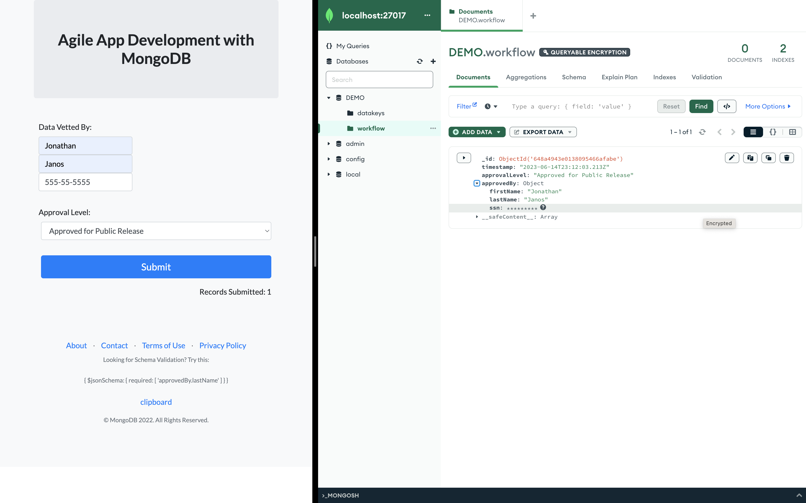
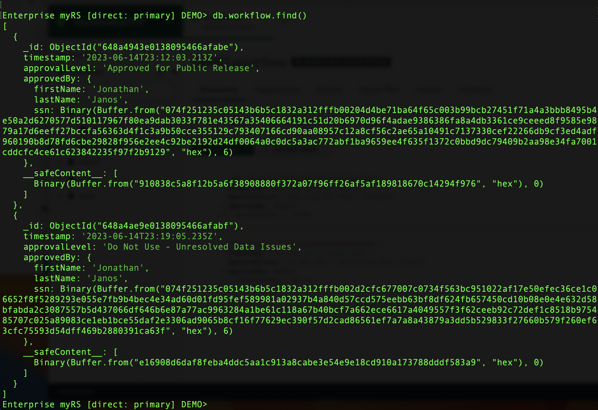
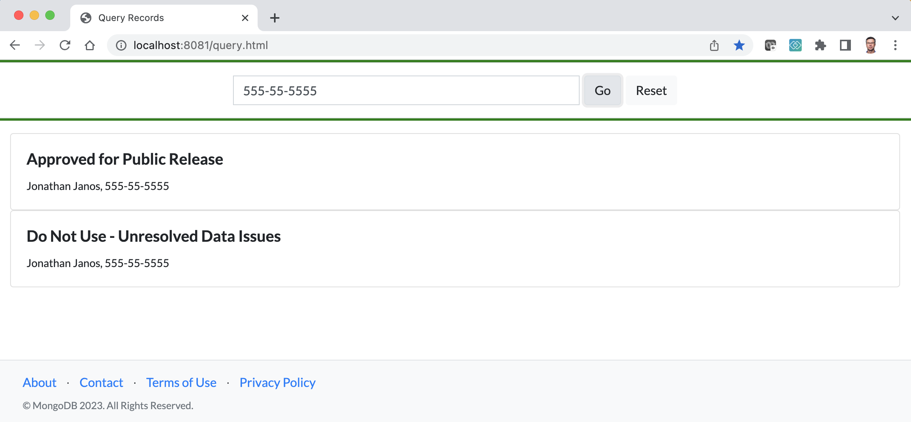

# MongoDB Queryable Encryption

MongoDB Queryable Encryption encrypts data at the application tier using fully randomized encryption (vs. deterministic encryption, which is considered less secure) while maintaining queryability. In a nutshell, it enables you to run encrypted queries on encrypted data. For more information, refer to this [blog](https://www.mongodb.com/blog/post/mongodb-releases-queryable-encryption-preview) and the [feature documentation](https://www.mongodb.com/docs/manual/core/queryable-encryption/).

An excellent demo of this capability has already been built and documented by Pierre Petersson - see [here](https://www.mongodb.com/developer/products/atlas/hashicorp-vault-kmip-secrets-engine-mongodb/). That demo includes a containerized KMIP Key Provider, which is required to manage the Customer Managed Key (CMK). Pierre uses HashiCorp Vault (using a trial license, which has to be obtained). It also contains a command-line Python application to demonstrate Queryable Encryption. My only intent here is to replace his Python application with a Node.js web application, the basis of which I had already developed (see [here](https://github.com/janosj/mongodb-web-app), and also [here](https://github.com/janosj/mongodb-search)). That web application was designed to show how applications can be developed more quickly using MongoDB - changes to the form do not require backend schema changes. With the addition of Queryable Encryption, sensitive fields can now be included. The resulting application looks like this (with MongoDB Compass on the right, showing the encrypted SSN field):

The Mongo Shell displays the encrypted fields values as shown below (with different ciphertext values for the same SSN):

Yet the data can still be queried:

<h2>Running the Demo</h2>

**Step 1: Prerequisites.** **Node.js** and **npm** have to be installed for the web application. Then, from the <em>code</em> directory, run "npm install" to install the dependencies defined in <em>package.json</em>. This demo also uses MongoDB Compass and the MongoDB Shell (mongosh), which are both clients that can installed on your local desktop. And of course, you have to have a MongoDB cluster running (either MongoDB Atlas or a self-managed MongoDB <em>Replica Set</em>).

**Step 2:** Launch the KMIP server. Queryable Encryption requires access to an external Key Management service to manage the Customer Master Key (CMK). This demonstration satisfies this requirement using HashiCorp Vault. Follow the instructions in Pierre's [blog](https://www.mongodb.com/developer/products/atlas/hashicorp-vault-kmip-secrets-engine-mongodb/). The Vault's endpoint and TLS certificates must then be specified in this project's <em>securityConf.js</em> configuration file. Note that a HashiCorp test license is still required. Any Python configuration steps can be skipped, since this demonstration uses a Node.js application in its place.

The Node.js application must be able to access the HashiCorp Vault server running inside the Docker container. To do this, the Vault port has to be exposed as follows:

> docker run -p 8200:8200 -p 5697:5697 -it -v ${PWD}:/kmip piepet/mongodb-kmip-vault:latest

In summary, the keys steps to get the Vault server running are:
1. Obtain a license file.
2. Run the Docker container, exposing port 5697.
3. Within the Docker container, run <em>start_and_configure_vault.sh</em> to configure Vault a
nd generate the TLS certificates.
4. Update <em>securityConf.js</em> with the TLS certicate info.

**Step 3:** Update the <em>securityConf.js</em> file with the KMIP connection details (i.e. the endpoint and the TLS settings). Also, the QE-enabled Node.js app requires access to the **Automatic Encryption Shared Library**. See the [feature documentation](https://www.mongodb.com/docs/v6.0/core/queryable-encryption/reference/shared-library/#std-label-qe-reference-shared-library-download) for download and installation instructions, and specify the path to the .dylib file in <em>securityConf.js</em>. 

**Step 4:** Start the Node.js web app. With the KMIP Key Provider server running (i.e. the HashiCorp Vault server), and the settings configured in <em>securityConf.js</em>, you can now start the Node.js application. Update the <em>runApp.sh</em> script with your MDB connect URI, and then execute the script. The data entry form can now be accessed from a web browser at http://localhost:8081. <em>index.html</em> is the original basic web form. A second web form, containing the SSN field, is accessible at http://localhost:8081/indexssn.html. The query form is accessible at <em>query.html</em>.

<h2>Recommended Demonstration Steps:</h2>

1. Access <em>index.html</em>, enter the fields, and submit the data to MongoDB. Use MongoDB Compass to show what the data looks like in MongoDB.
2. Modify the field to include both First Name and Last Name, and submit the data to MongoDB. Observe the new data model using MongoDB Compass.
3. Access <em>indexssn.html</em>, enter the fields, and submit the data once again. Observe the data in Compass, noting the encrypted SSN field.
4. Using the same SSN, click Submit once more. Using Mongo Shell, note the two different ciphertext binary values used to represent the same SSN value. This is randomized encryption in action. 
5. Finally, access the query form at <em>query.html</em>, and query by the SSN value. Note that both records are returned to the application, and the application is able to display the values is clear text!

